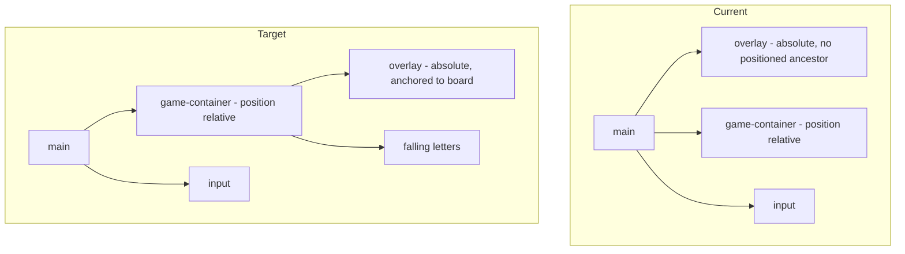

# UI Cleanup Plan

A phased plan to clean up the Letters UI. Phases are ordered so that each one is independently shippable and verifiable in the browser.

Two decisions are baked into this plan:

- **Theming:** implement real light and dark themes via CSS custom properties, plus a manual toggle button in the header.
- **Board sizing:** give the play area a fixed `aspect-ratio` so difficulty no longer scales with window height.

## Context

There is no test, lint, or typecheck script in [package.json](../package.json). The only automated gate is `npm run build`; everything else is manual verification via `npm run dev` at `http://localhost:3000/`.

Three behaviors documented in [features.md](./features.md) do not currently render at all. Phases 1 through 3 fix those, and are the highest-value, smallest-diff work in the plan.

## Phase 1 — Make the submit feedback visible

`docs/features.md` describes green, red, and blue border flashes on valid, invalid, and bonus words. None of them appear. The play area has no border, only an `outline`, so animating `border-color` paints nothing.

In [src/styles/game.less](../src/styles/game.less):

- Retarget `transition: border-color .5s ease` (line 11) to `outline-color`.
- Retarget all nine `border-color` keyframe stops to `outline-color` across the `.valid`, `.invalid`, and `.bonus` blocks (lines 41-66).

Keep `outline` rather than converting to `border`. An outline paints outside the box and does not participate in layout, so it leaves the letter coordinate math alone. A `.5em` border under the global `box-sizing: border-box` would shrink the content area while `getBoundingClientRect()` kept reporting the full border-box, pushing letters underneath the frame.

Also fold in a related bug. `#removeLife` in [src/game/game.ts](../src/game/game.ts) strips only two of the three animation classes before adding `invalid`, so losing a life immediately after a bonus word leaves both `bonus` and `invalid` applied at once:

```
    #removeLife = () => {
        this.#lives = Math.max(--this.#lives, 0);
        const el = this.el!;
        el.classList.remove('valid', 'invalid');
        el.offsetHeight; // Trigger DOM reflow
        el.classList.add('invalid');
    }
```

Collapse it to reuse `#toggleAnimationClass('invalid')`, which already strips all three.

**Verify:** all four triggers flash — valid word, invalid word, bonus word, and a letter reaching the bottom.

## Phase 2 — Anchor the game-over overlay to the board

The overlay is a sibling of the play area, and `main` is never `position: relative`, so its `top: 50%; left: 50%` centering resolves against the viewport rather than the board. It only looks correct today because the board happens to be centered.



- Move the overlay inside `#game-container` in [src/pages/index.astro](../src/pages/index.astro). The container's `overflow: hidden` will then clip it correctly.
- Tighten the constructor lookup from `this.el.parentElement.querySelector(...)` to `this.el.querySelector(...)`. The existing form still resolves after the move since it searches all descendants, but it no longer describes the structure.
- Change the element from `<label>` to `<div role="status">`.
- Replace the floating black pill with a full-bleed translucent backdrop, and drop `z-index: 1000` to a small value.
- Add a restart button inside the overlay, wired to the same `game.start()` handler as the header button.
- Replace the inline `style.display` writes in `#displayGameOver` with a class or `hidden` attribute toggle, so CSS owns presentation and the overlay can fade in.

## Phase 3 — Real hearts and a single HUD renderer

`features.md` says lives are shown as hearts, but the code renders a number plus one static heart, and the static markup ships `0 &#9829;` so there is a flash of zero lives before hydration.

The HUD is also rewritten 60 times a second whether or not it changed, with an `innerHTML` reparse each time, duplicated verbatim between `#resetState` (lines 96-97) and `#tick` (lines 126-127):

```
        this.scoreEl!.innerText = this.#score.toString();
        this.livesEl!.innerHTML =`${this.#lives.toString()} &#9829;`;
```

- Extract one `#renderHud()` called from both sites, caching last-rendered score and lives so it early-returns when nothing changed.
- Render lives as three heart elements built once at reset, then toggle a `depleted` class per heart. No markup regeneration per update.
- Add a `#maxLives = 3` field. The literal `3` is currently hardcoded at both the field initializer and in `#resetState`.
- Fix the server-rendered `0 &#9829;` in `index.astro` to match the starting state.

## Phase 4 — Board geometry

- Introduce `@board-width: 30em` and a `@board-aspect` variable, replacing the duplicated `width: 30em` on both `.game-container` (line 9) and `.game-header` (line 70).
- Give the board a fixed `aspect-ratio`. This requires removing the `flex-col` class from the container div in `index.astro`, since that utility applies `flex: 1 1`, which is what currently stretches the board to fill available height. The container's children are absolutely positioned, so it does not need to be a flex container; `position: relative` is already set.
- Close the board/input seam. The top-only radii on the board and bottom-only radii on the input are the signature of one joined panel, but `margin: 1em 0` and the input's intrinsic width break the illusion. Give the input `width: @board-width` and drop the bottom margin so the two are flush.

**Why it matters:** the board's height currently comes entirely from flex growth, and the death line is a fixed 70 game units mapped onto whatever height results. On a short window the board collapses and letters drain lives almost immediately.

## Phase 5 — Theme tokens, light and dark, manual toggle

The largest single diff, since it touches every color. Worth its own commit.

[src/styles/style.less](../src/styles/style.less) declares `color-scheme: light dark`, but every color is hardcoded for dark. The input is the one surface that actually flips with the OS theme, because it inherits UA defaults.

- Convert [src/styles/colors.less](../src/styles/colors.less) from four Less variables into semantic CSS custom properties on `:root`: background, chrome, foreground, score, lives, match highlight, valid, invalid, bonus, overlay backdrop.
- Define a dark set and a light set, selected by `[data-theme="dark"]` and `[data-theme="light"]`, with a `prefers-color-scheme` block as the no-preference default.
- Keep `color-scheme` switching alongside the tokens so native input chrome and scrollbars follow the theme.
- Replace every hardcoded color: `white` in the container outline, the nine keyframe stops, the overlay text and background, and the restart button border and hover; plus the raw `greenyellow` match highlight at line 24.
- Give the input explicit `background` and `color` so it stops inheriting UA defaults.
- Add a `data-theme-toggle` button to the header and a `src/theme.ts` that reads `localStorage`, falls back to `prefers-color-scheme`, and sets `data-theme` on `<html>`.
- Apply the stored theme from an `is:inline` script in `<head>` to avoid a flash of the wrong theme. Astro defers and bundles normal `<script>` tags, which would paint the default theme first.

Using `var()` as the value of an animatable property inside `@keyframes` is fine. It is animating a custom property itself that does not work, which this does not do.

## Phase 6 — Semantics, accessibility, and hook separation

Nearly every element is a `<label>` with no `for`: score, lives, the game-over message, and each falling letter.

- Score and lives become `<output>` or `<span>` with `aria-live="polite"`. The overlay already gets `role="status"` in Phase 2.
- Falling letters become `<span>`, which means updating the template in `createLetter` (lines 270-271). Trim the padding spaces in that template at the same time, since `clientWidth` feeds the position math.
- The input has no accessible name at all, only a placeholder. Add a visually hidden `<label for>` plus an `.sr-only` utility in `style.less`, or an `aria-label`.
- Reconsider `autofocus`, which pops the keyboard immediately on mobile. `start()` already calls `focus()`.
- Split styling hooks from JS hooks. `game.less` selects on `label[data-game-score]`, `input[data-game-input]`, and `button[data-restart-btn]`, so renaming a JS hook silently breaks styling. Move CSS onto classes and leave `data-*` for `querySelector` only.
- Fix the dead `transition: font-weight .3s ease` at line 21. Nothing changes a letter's weight, while `color` — which does change on match — is not transitioned, so highlights snap on and off.
- Add a `<meta name="description">` and a real `<title>`.

## Phase 7 — Per-frame performance

`#renderLetter` calls `getBoundingClientRect()` on the container once per letter per frame and reads `clientWidth`, then writes `style.top` and `style.left`. Interleaved reads and writes force a synchronous layout per letter:

```
        const bounds = this.el!.getBoundingClientRect();
        let containerWidth = bounds.width - letter.node.clientWidth;
        containerWidth = containerWidth - (containerWidth / this.#width);
        const containerHeight = bounds.height;
```

- Hoist the bounds read to once per `#tick` and pass it in.
- Cache each letter's width at creation.
- Switch positioning from `top`/`left` to `transform: translate3d()` to move letters onto the compositor.
- Add a `ResizeObserver` to invalidate cached bounds instead of re-reading every frame.
- Optionally gate `#focusInputLetters` behind a dirty flag. It also has to recompute when the letter set changes, so the win is much smaller than the layout fix.

Phases 6 and 7 both edit `createLetter` and the letter markup, so running them back to back avoids re-touching the same code.

## Phase 8 — Responsiveness, word feedback, and cleanup

There are currently zero media queries in the project.

- Add breakpoints that scale `@board-width` and the several `2.5em` type sizes down on small screens, or move to `clamp()`.
- Add a visible danger line. Letters die at `position.y >= this.#height - 2` with `#height = 70`, so the threshold is 97% of the board — and because it is measured against the letter's top edge, a dying letter is still mostly on screen, which reads as arbitrary. Set the line position from JS as a CSS custom property so the threshold has one source of truth rather than being duplicated in the stylesheet. Depends on Phase 4 for a stable board height.
- Add feedback at the input: last word and points earned, and distinguish "already used" from "not a word." This needs `#handleInputKeyDown` to split its two conditions, currently collapsed into a single boolean at line 218. A used-words list fits the same region.
- Guard the header restart button so a mid-game misclick cannot silently wipe a run.
- Update [features.md](./features.md) to match reality: hearts, the theme toggle, the danger line, word feedback, overlay restart, and the "white border" wording that should say outline.
- Clear the stale `// NONNY ADDITION:` comment at line 257 and the `dobule` typo at line 228.

## Sequencing summary

- Phases 1-3 are small, independently shippable, and together fix everything outright broken.
- Phase 4 must land before Phase 8's danger line.
- Phase 5 is the largest diff and belongs on its own commit.
- Phases 6 and 7 should run back to back.
